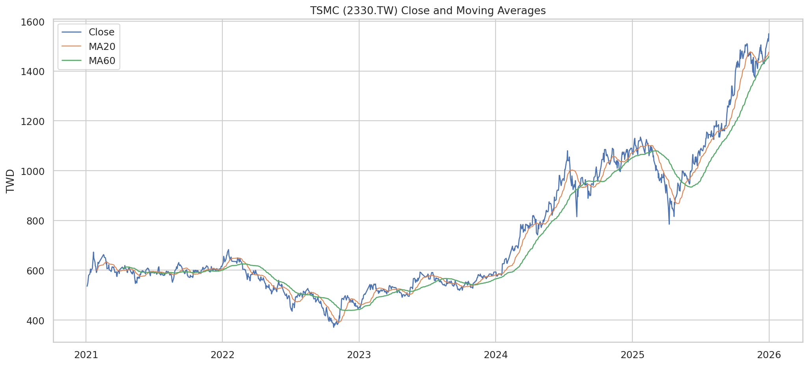
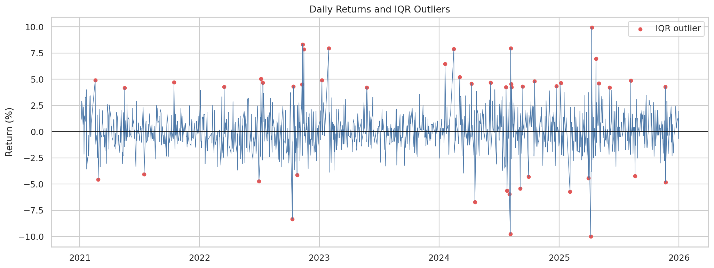
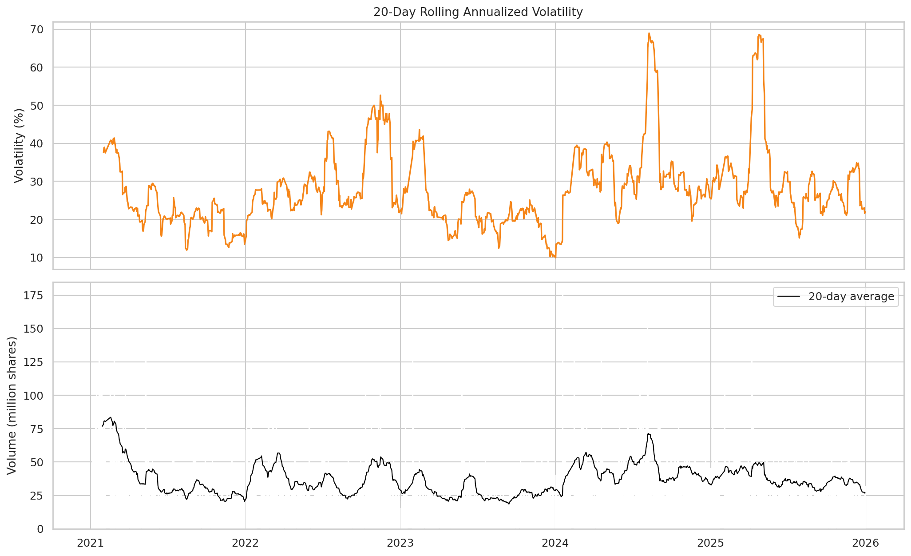
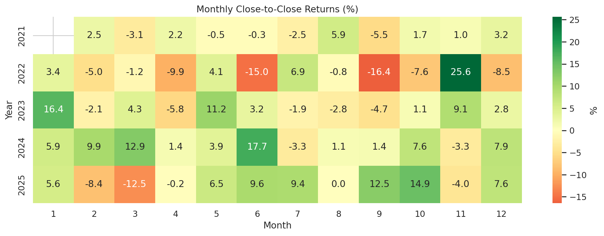
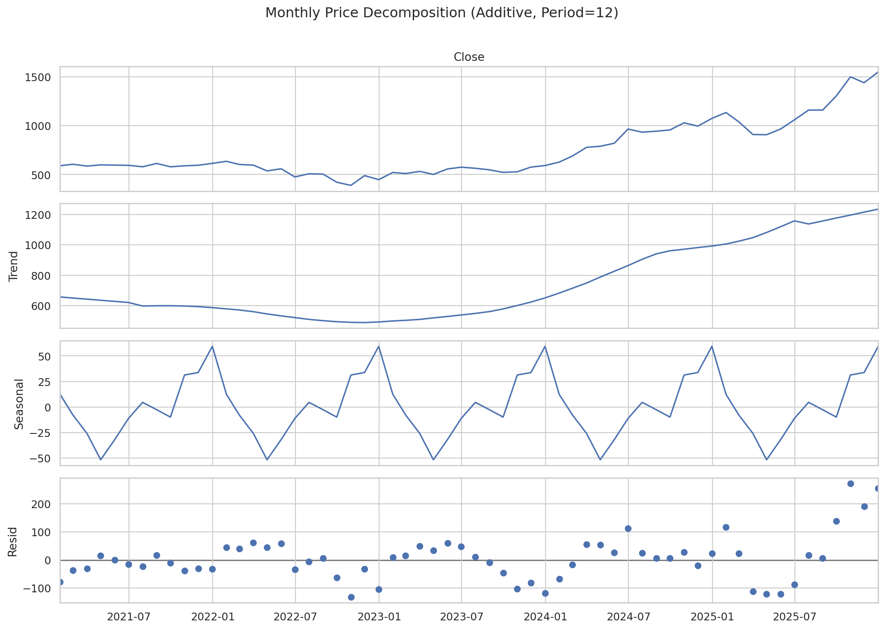
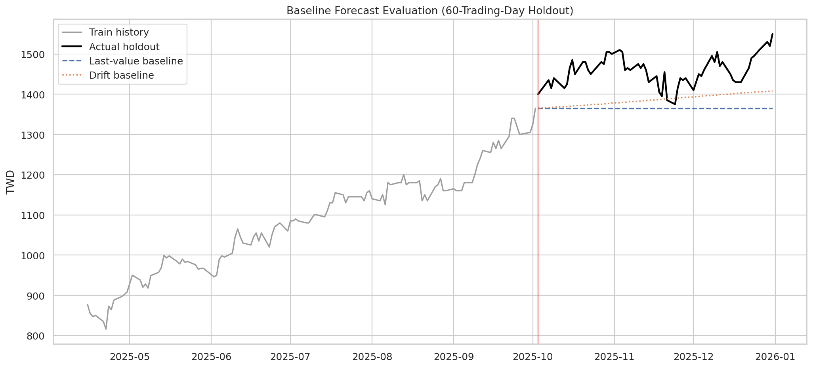

# TSMC 2021~2025년 주가 트렌드 분석 리포트

## 1. 분석 주제 및 선정 이유

이 프로젝트는 대만증권거래소에 상장된 TSMC 본주(2330.TW)의 일별 가격과 거래량을 이용해 장기 추세, 변동성, 이상 움직임과 거래량의 관계를 분석한다. AI 반도체 성장기가 포함된 기간이지만, 가격 데이터만으로 원인을 확정하지 않고 **관찰 가능한 사실**과 **가능한 해석**을 구분한다.

## 2. 분석 질문

1. 2021~2025년에 장기 추세와 이동평균 기반 시장 국면은 어떻게 변했는가?
2. MA20이 MA60 이상인 구간과 미만인 구간의 수익률·변동성은 어떻게 다른가?
3. 가장 큰 급등·급락과 IQR 이상치는 언제였는가?
4. 거래량 상위 10% 거래일의 절대수익률은 나머지 거래일보다 큰가?
5. 월별 수익률에 반복되는 패턴이 보이는가?
6. 단순 예측 기준선이 마지막 60거래일을 어느 정도 설명하는가?

## 3. 데이터 설명 및 정제

- 출처: [Taiwan Stock Exchange Corporation, STOCK_DAY](https://www.twse.com.tw/exchangeReport/STOCK_DAY)
- 종목: TSMC(2330.TW)
- 조회 기간: 2021-01-01 ~ 2025-12-31
- 실제 관측 기간: 2021-01-04 ~ 2025-12-31
- 데이터 포인트: 1,214개 거래일
- 컬럼: 시가, 고가, 저가, 종가, 거래량, 거래대금, 전일 대비 변화, 거래 건수
- 중복 날짜 제거: 0개
- 잘못된 OHLC 행: 0개
- 휴장일 보간: 하지 않음. 휴장일은 오류나 결측 관측치가 아니므로 인위적으로 채우지 않았다.
- 이상치: 삭제하지 않고 IQR 기준으로 표시했다. 실제 시장 충격일 가능성이 있기 때문이다.

이 분석은 TWSE 공식 **종가**를 사용한다. 현금배당을 재투자한 수정주가·총수익률 분석이 아니므로 배당락의 영향이 일부 포함될 수 있다.

## 4. 분석 방법

- 20일·60일 단순이동평균으로 단기/중기 추세 비교
- 일간 수익률 및 월말 종가 기준 월간 수익률
- 20일 수익률 표준편차를 252거래일 기준으로 연율화한 변동성
- IQR(1.5×IQR) 기준 일간 수익률 이상치 탐지
- 거래량 상위 10%와 나머지 구간의 평균 절대수익률 비교
- 월별 종가를 이용한 가법 계절 분해(주기 12개월)
- 마지막 60거래일 홀드아웃에 대한 마지막 값·드리프트 기준선 예측

## 5. 시각화 및 결과

### 5.1 가격과 이동평균

### 5.2 일간 수익률과 이상치

### 5.3 변동성과 거래량

### 5.4 월별 수익률

## 6. 인사이트

### 인사이트 1 — 장기 가격 변화와 추세 국면

- **관찰(Fact):** 첫 종가 536.00 TWD에서 마지막 종가 1,550.00 TWD로 변해 기간 가격 변화율은 189.18%였다. MA20 ≥ MA60 구간은 741거래일, 반대 구간은 414거래일이었다.
- **해석(Hypothesis):** 이동평균 우위 구간은 상승 모멘텀이 지속된 시기를 표시할 수 있지만, 이동평균은 후행지표이므로 전환 원인을 설명하지 못한다.
- **행동(Action):** 주요 교차 시점 주변의 분기 실적·가이던스·산업 수요 자료를 별도로 대조한다.

### 인사이트 2 — 시장 국면별 수익률과 위험

- **관찰(Fact):** MA20 ≥ MA60 구간의 평균 일간 수익률은 0.118%, 연율화 변동성은 27.63%였다. MA20 < MA60 구간은 각각 0.062%, 32.48%였다.
- **해석(Hypothesis):** 두 구간 차이는 추세와 위험의 동행 가능성을 보여주지만, 이동평균 자체가 가격으로 계산되므로 독립적인 인과 설명은 아니다.
- **행동(Action):** 동일 기준을 대만 가권지수에 적용해 TSMC 고유 효과와 시장 공통 효과를 분리한다.

### 인사이트 3 — 급등·급락은 삭제할 오류가 아니다

- **관찰(Fact):** IQR 기준 이상치는 48일이었다. 최대 상승은 2025-04-10의 9.94%, 최대 하락은 2025-04-07의 -9.98%였다. 전체 연율화 변동성은 29.60%였다.
- **해석(Hypothesis):** 이 날짜들은 실적, 거시경제 또는 지정학적 뉴스 후보일 수 있으나 가격 데이터만으로 원인을 확정할 수 없다.
- **행동(Action):** 해당 날짜 전후 공시와 신뢰 가능한 뉴스 타임라인을 확인한다.

### 인사이트 4 — 거래량과 가격 움직임

- **관찰(Fact):** 거래량 상위 10% 거래일의 평균 절대수익률은 2.992%, 나머지는 1.168%로, 전자가 약 2.56배였다.
- **해석(Hypothesis):** 거래 집중일에 정보 반영과 가격 재평가가 함께 나타났을 가능성이 있다. 그러나 동시 움직임은 거래량이 변동의 원인임을 뜻하지 않는다.
- **행동(Action):** 상승일과 하락일을 분리하고 거래량 급증 전후 수익률을 비교한다.

## 7. 보너스 1 — 탐색형 대시보드

`streamlit run app.py`로 실행한다. 날짜 범위, 단기·장기 이동평균, 변동성 창을 바꾸며 가격·수익률·위험·거래량을 탐색할 수 있다. 제출 시 로컬 실행 화면 녹화 또는 스크린샷 세트를 추가하면 된다.

## 8. 보너스 2 — 시계열 심화

### 8.1 월별 시계열 분해

- **관찰:** 월말 종가를 추세·12개월 계절 성분·잔차로 분해했다.
- **한계:** 5년은 연간 계절성을 안정적으로 주장하기에 짧고, 주가는 고정된 계절성이 약한 비정상 시계열이다. 분해 결과는 탐색적 표현으로만 사용한다.

### 8.2 단순 기준선 예측

마지막 60거래일(2025-10-03~2025-12-31)을 훈련에서 제외했다.

| 모델 | MAE(TWD) | RMSE(TWD) | MAPE |
|---|---:|---:|---:|
| 마지막 값 유지 | 93.67 | 100.53 | 6.36% |
| 선형 드리프트 | 72.34 | 80.23 | 4.91% |

이는 투자 예측 모델이 아니라 복잡한 모델이 최소한 넘어야 하는 기준선이다. 단일 홀드아웃 결과는 시기에 민감하며 거래비용, 배당, 외부 변수를 반영하지 않는다.

## 9. 결론 및 한계점

가격·수익률·롤링 변동성·거래량을 결합하면 단순 가격 그래프보다 시장 국면을 구체적으로 설명할 수 있다. 그러나 본 분석은 관찰 연구이며 기업 실적, 환율, 금리, 산업 지수, 지정학적 사건을 직접 모델링하지 않았다. 또한 수정주가가 아닌 TWSE 종가를 사용했고, 계절성과 예측은 짧은 표본에 기반한다. 따라서 결과를 매매 신호나 인과관계로 해석해서는 안 된다.

## 10. AI 사용 로그

| 사용 작업 | 사용 이유 | 검증 방법 |
|---|---|---|
| TWSE 수집·정제 코드 초안 | 반복 구현 시간 절감 | 데이터 개수·날짜·중복·결측·OHLC 논리 검사 |
| 이동평균·수익률·변동성 코드 | 계산 대안 탐색 | 정의를 코드에 명시하고 표본 행을 수동 대조 |
| 시각화 코드 | 일관된 그래프 생성 | 축·단위·기간·파일 링크 확인 |
| 인사이트 문장 구조 | 관찰과 해석 분리 | 모든 수치가 metrics.json에서 재생성되는지 확인 |
| 예측 기준선 구현 | 누수 없는 비교 기준 마련 | 마지막 60일을 완전히 분리하고 MAE/RMSE/MAPE 재계산 |

AI가 제안한 결과를 그대로 사실로 채택하지 않았으며, 수치 결과는 전체 파이프라인 재실행으로 검증했다.
